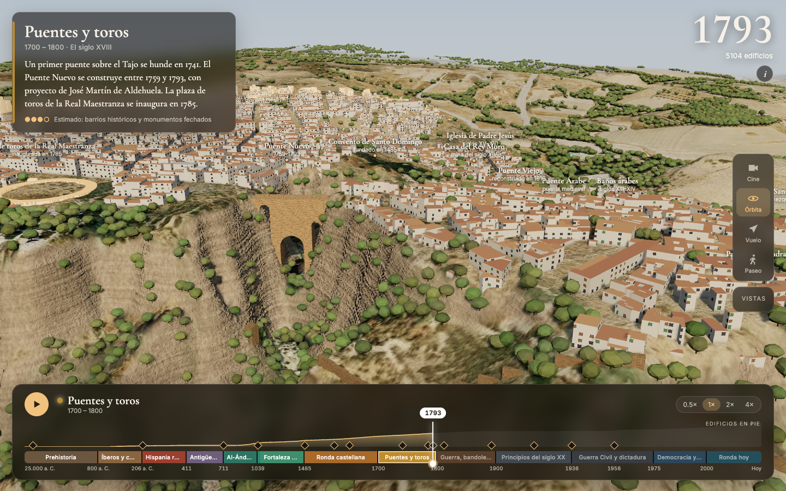

# Ronda a través del tiempo

Línea de tiempo interactiva en 3D (Three.js) de Ronda (Málaga), de la prehistoria a hoy.



## Ejecutar

```bash
npm install
npm run dev      # http://localhost:5173
npm run build    # sitio estático en dist/ (Vercel, GitHub Pages…)
```

## Datos (`scripts/`, necesita `uv`)

| Script | Resultado |
|---|---|
| `fetch_raster.py` | MDT05 del IGN y ortofotos (1956, 1973–86, 2004, 2024) de 4 × 4 km |
| `fetch_hires.py` | ortofoto 2024 a 0,5 m del centro (2 × 2 km) |
| `process_buildings.py` | edificios del Catastro con año estimado → `public/data/buildings.json` |
| `export_terrain.py` | `public/data/dem.bin` |
| `make_landscape.py` | paisaje histórico (ciudad sustituida por campo), árboles detectados, texturas WebP |
| `grid_view.py` | imagen de depuración para dibujar `zones.json` |

Catastro no tiene años anteriores a 1900 y para casas antiguas guarda el año de la última
reforma. Dentro de los barrios históricos de `scripts/zones.json` (dibujados sobre la foto de
1956) el año es una estimación. Fuera de ellos se usa el año del Catastro.

## Código

- `src/timeline.ts`: escala del tiempo, épocas, hitos y textos
- `src/terrain.ts`: terreno, mezcla de fotos por año, roca en los tajos, relieve fino
- `src/buildings.ts`: todos los edificios en una malla; crecen en su año; ventanas y tejas
- `src/trees.ts`: ~60.000 árboles detectados en la ortofoto
- `src/landmarks.ts`: puentes, murallas, alcazaba, etiquetas
- `src/camera.ts`: modos Cine, Órbita, Vuelo y Paseo, y vistas
- `src/ui.ts`: barra de tiempo
- `tools/shot.mjs`: capturas con GPU real (Chrome headless + Playwright de otro proyecto)
